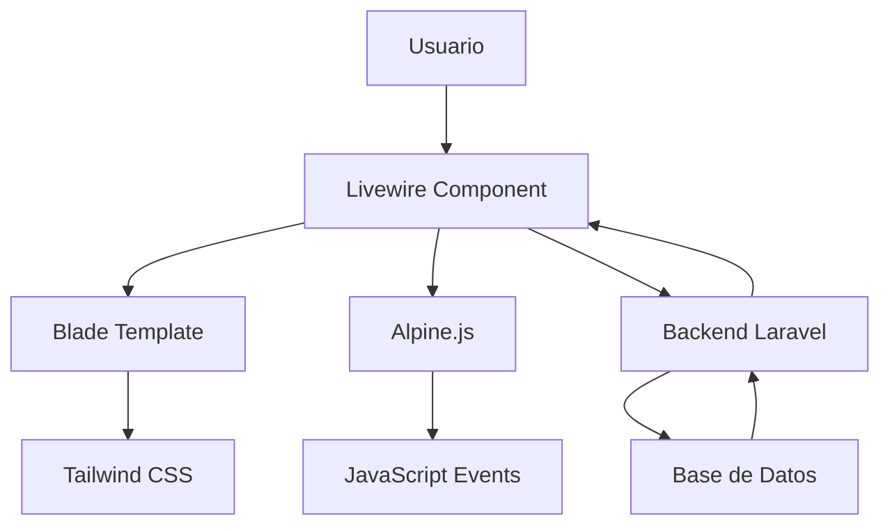

# 🎨 Documentación del Frontend

Esta documentación detalla la arquitectura frontend del sistema, incluyendo Livewire, Tailwind CSS, Alpine.js y todas las vistas y componentes de la interfaz de usuario.

## 📋 Índice

1. [Arquitectura Frontend](#arquitectura-frontend)
2. [Tecnologías Utilizadas](#tecnologías-utilizadas)
3. [Componentes Livewire](#componentes-livewire)
4. [Sistema de Autenticación](#sistema-de-autenticación)
5. [Layouts y Templates](#layouts-y-templates)
6. [Estilos y Diseño](#estilos-y-diseño)
7. [Interactividad JavaScript](#interactividad-javascript)
8. [Componentes Reutilizables](#componentes-reutilizables)
9. [Responsive Design](#responsive-design)
10. [Optimización y Performance](#optimización-y-performance)

---

## 🏗️ Arquitectura Frontend

### Estructura General

```
resources/
├── css/
│   ├── app.css                 # Estilos principales
│   └── filament.css           # Estilos para Filament
├── js/
│   ├── app.js                 # JavaScript principal
│   ├── bootstrap.js           # Configuración inicial
│   └── components/            # Componentes JS reutilizables
│       ├── notification.js
│       ├── modal.js
│       └── charts.js
└── views/
    ├── layouts/               # Layouts principales
    │   ├── app.blade.php
    │   ├── guest.blade.php
    │   └── navigation.blade.php
    ├── components/            # Componentes Blade
    │   ├── button.blade.php
    │   ├── modal.blade.php
    │   ├── alert.blade.php
    │   └── forms/
    ├── livewire/             # Vistas de componentes Livewire
    │   ├── dashboard.blade.php
    │   ├── ticket-list.blade.php
    │   ├── ticket-detail.blade.php
    │   ├── ticket-create.blade.php
    │   └── navigation.blade.php
    ├── auth/                 # Vistas de autenticación
    └── exports/              # Templates para exportaciones
```

### Flujo de Datos



---

## 🛠️ Tecnologías Utilizadas

### 1. Livewire 3

**Propósito:** Framework para crear SPAs sin escribir JavaScript
**Versión:** 3.x
**Uso:** Componentes dinámicos e interactivos

### 2. Tailwind CSS

**Propósito:** Framework CSS utility-first
**Versión:** 3.x
**Configuración:** `tailwind.config.js`

### 3. Alpine.js

**Propósito:** Framework JavaScript minimalista
**Versión:** 3.x
**Uso:** Interactividad del lado del cliente

### 4. Blade Templates

**Propósito:** Motor de plantillas de Laravel
**Uso:** Renderizado de vistas y componentes

### 5. Vite

**Propósito:** Bundler para assets
**Configuración:** `vite.config.js`

---

## ⚡ Componentes Livewire

### 1. Dashboard Component

**Archivo:** `app/Livewire/Dashboard.php`
**Vista:** `resources/views/livewire/dashboard.blade.php`

#### Funcionalidades
- Estadísticas en tiempo real
- Gráficos interactivos
- Widgets reutilizables
- Filtros de fecha

#### Estructura de la Vista
```blade
<div class="p-6 space-y-6">
    <!-- Header con filtros -->
    <div class="flex justify-between items-center">
        <h1 class="text-2xl font-semibold text-gray-900">Dashboard</h1>
        <div class="flex space-x-4">
            <select wire:model.live="filtroArea" class="rounded-md border-gray-300">
                <option value="">Todas las áreas</option>
                @foreach($areas as $area)
                    <option value="{{ $area->id }}">{{ $area->nombre }}</option>
                @endforeach
            </select>
        </div>
    </div>

    <!-- Tarjetas de estadísticas -->
    <div class="grid grid-cols-1 md:grid-cols-2 lg:grid-cols-4 gap-6">
        @foreach($estadisticas as $stat)
            <div class="bg-white rounded-lg shadow p-6">
                <div class="flex items-center">
                    <div class="flex-1">
                        <p class="text-sm font-medium text-gray-600">{{ $stat['titulo'] }}</p>
                        <p class="text-2xl font-semibold text-gray-900">{{ $stat['valor'] }}</p>
                    </div>
                    <div class="ml-4">
                        <div class="w-8 h-8 bg-{{ $stat['color'] }}-100 rounded-full flex items-center justify-center">
                            <x-heroicon-o-{{ $stat['icono'] }} class="w-4 h-4 text-{{ $stat['color'] }}-600" />
                        </div>
                    </div>
                </div>
            </div>
        @endforeach
    </div>

    <!-- Gráficos -->
    <div class="grid grid-cols-1 lg:grid-cols-2 gap-6">
        <!-- Gráfico de tickets por área -->
        <div class="bg-white rounded-lg shadow p-6">
            <h3 class="text-lg font-medium text-gray-900 mb-4">Tickets por Área</h3>
            <canvas id="chartArea" wire:ignore></canvas>
        </div>

        <!-- Gráfico de tendencias -->
        <div class="bg-white rounded-lg shadow p-6">
            <h3 class="text-lg font-medium text-gray-900 mb-4">Tendencia de Tickets</h3>
            <canvas id="chartTendencia" wire:ignore></canvas>
        </div>
    </div>
</div>

@script
<script>
    $wire.on('chartDataUpdated', (data) => {
        updateCharts(data);
    });
    
    function updateCharts(data) {
        // Lógica para actualizar gráficos
    }
</script>
@endscript
```

### 2. TicketList Component

**Archivo:** `app/Livewire/TicketList.php`
**Vista:** `resources/views/livewire/ticket-list.blade.php`

#### Funcionalidades
- Lista paginada de tickets
- Filtros avanzados
- Búsqueda en tiempo real
- Exportación Excel/PDF
- Ordenamiento dinámico

#### Estructura de la Vista
```blade
<div class="space-y-6">
    <!-- Filtros y búsqueda -->
    <div class="bg-white rounded-lg shadow p-6">
        <div class="grid grid-cols-1 md:grid-cols-4 gap-4">
            <!-- Búsqueda -->
            <div class="md:col-span-2">
                <label class="block text-sm font-medium text-gray-700 mb-2">Búsqueda</label>
                <input 
                    type="text" 
                    wire:model.live.debounce.300ms="search" 
                    placeholder="Buscar por título o descripción..."
                    class="w-full rounded-md border-gray-300 shadow-sm focus:border-indigo-500 focus:ring-indigo-500"
                >
            </div>

            <!-- Filtro por estado -->
            <div>
                <label class="block text-sm font-medium text-gray-700 mb-2">Estado</label>
                <select wire:model.live="filtroEstado" class="w-full rounded-md border-gray-300">
                    <option value="">Todos</option>
                    @foreach($estados as $estado)
                        <option value="{{ $estado }}">{{ $estado }}</option>
                    @endforeach
                </select>
            </div>

            <!-- Filtro por prioridad -->
            <div>
                <label class="block text-sm font-medium text-gray-700 mb-2">Prioridad</label>
                <select wire:model.live="filtroPrioridad" class="w-full rounded-md border-gray-300">
                    <option value="">Todas</option>
                    @foreach($prioridades as $prioridad)
                        <option value="{{ $prioridad }}">{{ $prioridad }}</option>
                    @endforeach
                </select>
            </div>
        </div>

        <!-- Botones de acción -->
        <div class="mt-4 flex justify-between items-center">
            <div class="flex space-x-2">
                <button wire:click="exportExcel" class="btn-secondary">
                    <x-heroicon-o-document-arrow-down class="w-4 h-4 mr-2" />
                    Exportar Excel
                </button>
                <button wire:click="exportPdf" class="btn-secondary">
                    <x-heroicon-o-document class="w-4 h-4 mr-2" />
                    Exportar PDF
                </button>
            </div>
            
            <button wire:click="$dispatch('openCreateModal')" class="btn-primary">
                <x-heroicon-o-plus class="w-4 h-4 mr-2" />
                Nuevo Ticket
            </button>
        </div>
    </div>

    <!-- Tabla de tickets -->
    <div class="bg-white rounded-lg shadow overflow-hidden">
        <div class="overflow-x-auto">
            <table class="min-w-full divide-y divide-gray-200">
                <thead class="bg-gray-50">
                    <tr>
                        <th class="px-6 py-3 text-left text-xs font-medium text-gray-500 uppercase tracking-wider">
                            <button wire:click="sortBy('titulo')" class="flex items-center space-x-1">
                                <span>Título</span>
                                @if($sortField === 'titulo')
                                    <x-heroicon-o-chevron-{{ $sortDirection === 'asc' ? 'up' : 'down' }} class="w-4 h-4" />
                                @endif
                            </button>
                        </th>
                        <th class="px-6 py-3 text-left text-xs font-medium text-gray-500 uppercase tracking-wider">Área</th>
                        <th class="px-6 py-3 text-left text-xs font-medium text-gray-500 uppercase tracking-wider">Prioridad</th>
                        <th class="px-6 py-3 text-left text-xs font-medium text-gray-500 uppercase tracking-wider">Estado</th>
                        <th class="px-6 py-3 text-left text-xs font-medium text-gray-500 uppercase tracking-wider">SLA</th>
                        <th class="px-6 py-3 text-left text-xs font-medium text-gray-500 uppercase tracking-wider">Asignado</th>
                        <th class="px-6 py-3 text-left text-xs font-medium text-gray-500 uppercase tracking-wider">Fecha</th>
                        <th class="px-6 py-3 text-left text-xs font-medium text-gray-500 uppercase tracking-wider">Acciones</th>
                    </tr>
                </thead>
                <tbody class="bg-white divide-y divide-gray-200">
                    @forelse($tickets as $ticket)
                        <tr class="hover:bg-gray-50 transition-colors duration-200">
                            <td class="px-6 py-4 whitespace-nowrap">
                                <div>
                                    <div class="text-sm font-medium text-gray-900">{{ $ticket->titulo }}</div>
                                    <div class="text-sm text-gray-500">{{ Str::limit($ticket->descripcion, 50) }}</div>
                                </div>
                            </td>
                            <td class="px-6 py-4 whitespace-nowrap text-sm text-gray-900">
                                {{ $ticket->area->nombre }}
                            </td>
                            <td class="px-6 py-4 whitespace-nowrap">
                                <span class="inline-flex items-center px-2.5 py-0.5 rounded-full text-xs font-medium 
                                    {{ $ticket->prioridad === 'Critica' ? 'bg-red-100 text-red-800' : 
                                       ($ticket->prioridad === 'Alta' ? 'bg-orange-100 text-orange-800' : 
                                       ($ticket->prioridad === 'Media' ? 'bg-yellow-100 text-yellow-800' : 'bg-gray-100 text-gray-800')) }}">
                                    {{ $ticket->prioridad }}
                                </span>
                            </td>
                            <td class="px-6 py-4 whitespace-nowrap">
                                <span class="inline-flex items-center px-2.5 py-0.5 rounded-full text-xs font-medium 
                                    {{ $ticket->estado === 'Abierto' ? 'bg-red-100 text-red-800' : 
                                       ($ticket->estado === 'En Progreso' ? 'bg-yellow-100 text-yellow-800' : 
                                       ($ticket->estado === 'Cerrado' ? 'bg-green-100 text-green-800' : 'bg-gray-100 text-gray-800')) }}">
                                    {{ $ticket->estado }}
                                </span>
                            </td>
                            <td class="px-6 py-4 whitespace-nowrap">
                                @php
                                    $estadoSla = $ticket->getEstadoSla();
                                    $tiempoRestante = $ticket->getTiempoRestanteSla('respuesta');
                                @endphp
                                <div class="flex items-center">
                                    <span class="inline-flex items-center px-2.5 py-0.5 rounded-full text-xs font-medium 
                                        {{ $estadoSla === 'ok' ? 'bg-green-100 text-green-800' : 
                                           ($estadoSla === 'advertencia' ? 'bg-yellow-100 text-yellow-800' : 'bg-red-100 text-red-800') }}">
                                        @if($tiempoRestante === null)
                                            Sin SLA
                                        @elseif($tiempoRestante <= 0)
                                            Vencido
                                        @else
                                            {{ floor($tiempoRestante / 60) }}h {{ $tiempoRestante % 60 }}m
                                        @endif
                                    </span>
                                </div>
                            </td>
                            <td class="px-6 py-4 whitespace-nowrap text-sm text-gray-900">
                                {{ $ticket->asignadoA?->name ?? 'Sin asignar' }}
                            </td>
                            <td class="px-6 py-4 whitespace-nowrap text-sm text-gray-500">
                                {{ $ticket->created_at->format('d/m/Y H:i') }}
                            </td>
                            <td class="px-6 py-4 whitespace-nowrap text-sm font-medium">
                                <div class="flex space-x-2">
                                    <button 
                                        wire:click="viewTicket({{ $ticket->id }})" 
                                        class="text-indigo-600 hover:text-indigo-900"
                                        title="Ver detalles"
                                    >
                                        <x-heroicon-o-eye class="w-4 h-4" />
                                    </button>
                                    @if(!$ticket->escalado && $ticket->estado !== 'Cerrado')
                                        <button 
                                            wire:click="escalarTicket({{ $ticket->id }})" 
                                            class="text-orange-600 hover:text-orange-900"
                                            title="Escalar ticket"
                                        >
                                            <x-heroicon-o-arrow-trending-up class="w-4 h-4" />
                                        </button>
                                    @endif
                                </div>
                            </td>
                        </tr>
                    @empty
                        <tr>
                            <td colspan="8" class="px-6 py-4 text-center text-gray-500">
                                No se encontraron tickets
                            </td>
                        </tr>
                    @endforelse
                </tbody>
            </table>
        </div>

        <!-- Paginación -->
        <div class="bg-white px-4 py-3 border-t border-gray-200">
            {{ $tickets->links() }}
        </div>
    </div>

    <!-- Modal de creación -->
    <livewire:ticket-create />

    <!-- Modal de detalles -->
    <livewire:ticket-detail />
</div>
```

### 3. TicketDetail Component

**Archivo:** `app/Livewire/TicketDetail.php`
**Vista:** `resources/views/livewire/ticket-detail.blade.php`

#### Funcionalidades
- Vista detallada del ticket
- Sistema de comentarios
- Edición inline
- Cambio de estado
- Exportación PDF individual

#### Estructura de la Vista
```blade
<div
    x-data="{ 
        open: @entangle('showModal'),
        activeTab: 'detalles' 
    }"
    x-show="open"
    x-cloak
    class="fixed inset-0 z-50 overflow-y-auto"
    style="display: none;"
>
    <!-- Overlay -->
    <div class="fixed inset-0 bg-black bg-opacity-50 transition-opacity" x-show="open" x-transition></div>

    <!-- Modal -->
    <div class="flex min-h-screen items-end justify-center px-4 pt-4 pb-20 text-center sm:block sm:p-0">
        <div 
            x-show="open" 
            x-transition:enter="ease-out duration-300"
            x-transition:enter-start="opacity-0 translate-y-4 sm:translate-y-0 sm:scale-95"
            x-transition:enter-end="opacity-100 translate-y-0 sm:scale-100"
            class="inline-block w-full max-w-4xl my-8 text-left align-middle transition-all transform bg-white shadow-xl rounded-lg"
        >
            @if($ticket)
                <!-- Header del modal -->
                <div class="px-6 py-4 border-b border-gray-200">
                    <div class="flex items-center justify-between">
                        <div>
                            <h3 class="text-lg font-medium text-gray-900">
                                Ticket #{{ $ticket->id }} - {{ $ticket->titulo }}
                            </h3>
                            <div class="mt-1 flex items-center space-x-4">
                                <span class="inline-flex items-center px-2.5 py-0.5 rounded-full text-xs font-medium 
                                    {{ $ticket->prioridad === 'Critica' ? 'bg-red-100 text-red-800' : 
                                       ($ticket->prioridad === 'Alta' ? 'bg-orange-100 text-orange-800' : 
                                       ($ticket->prioridad === 'Media' ? 'bg-yellow-100 text-yellow-800' : 'bg-gray-100 text-gray-800')) }}">
                                    {{ $ticket->prioridad }}
                                </span>
                                <span class="inline-flex items-center px-2.5 py-0.5 rounded-full text-xs font-medium 
                                    {{ $ticket->estado === 'Abierto' ? 'bg-red-100 text-red-800' : 
                                       ($ticket->estado === 'En Progreso' ? 'bg-yellow-100 text-yellow-800' : 
                                       ($ticket->estado === 'Cerrado' ? 'bg-green-100 text-green-800' : 'bg-gray-100 text-gray-800')) }}">
                                    {{ $ticket->estado }}
                                </span>
                                @if($ticket->escalado)
                                    <span class="inline-flex items-center px-2.5 py-0.5 rounded-full text-xs font-medium bg-red-100 text-red-800">
                                        <x-heroicon-o-arrow-trending-up class="w-3 h-3 mr-1" />
                                        Escalado
                                    </span>
                                @endif
                            </div>
                        </div>
                        <div class="flex items-center space-x-2">
                            <button wire:click="exportTicketPdf" class="btn-secondary">
                                <x-heroicon-o-document class="w-4 h-4 mr-1" />
                                PDF
                            </button>
                            <button @click="open = false" class="text-gray-400 hover:text-gray-600">
                                <x-heroicon-o-x-mark class="w-6 h-6" />
                            </button>
                        </div>
                    </div>
                </div>

                <!-- Navegación por pestañas -->
                <div class="border-b border-gray-200">
                    <nav class="flex px-6">
                        <button 
                            @click="activeTab = 'detalles'"
                            :class="activeTab === 'detalles' ? 'border-indigo-500 text-indigo-600' : 'border-transparent text-gray-500 hover:text-gray-700'"
                            class="whitespace-nowrap py-4 px-1 border-b-2 font-medium text-sm mr-8"
                        >
                            Detalles
                        </button>
                        <button 
                            @click="activeTab = 'comentarios'"
                            :class="activeTab === 'comentarios' ? 'border-indigo-500 text-indigo-600' : 'border-transparent text-gray-500 hover:text-gray-700'"
                            class="whitespace-nowrap py-4 px-1 border-b-2 font-medium text-sm mr-8"
                        >
                            Comentarios ({{ $ticket->comments->count() }})
                        </button>
                        <button 
                            @click="activeTab = 'historial'"
                            :class="activeTab === 'historial' ? 'border-indigo-500 text-indigo-600' : 'border-transparent text-gray-500 hover:text-gray-700'"
                            class="whitespace-nowrap py-4 px-1 border-b-2 font-medium text-sm"
                        >
                            Historial
                        </button>
                    </nav>
                </div>

                <!-- Contenido del modal -->
                <div class="p-6 max-h-96 overflow-y-auto">
                    <!-- Pestaña Detalles -->
                    <div x-show="activeTab === 'detalles'">
                        <div class="grid grid-cols-1 md:grid-cols-2 gap-6">
                            <!-- Información básica -->
                            <div class="space-y-4">
                                <div>
                                    <label class="block text-sm font-medium text-gray-700">Descripción</label>
                                    <p class="mt-1 text-sm text-gray-900">{{ $ticket->descripcion }}</p>
                                </div>

                                <div>
                                    <label class="block text-sm font-medium text-gray-700">Área</label>
                                    <p class="mt-1 text-sm text-gray-900">{{ $ticket->area->nombre }}</p>
                                </div>

                                <div>
                                    <label class="block text-sm font-medium text-gray-700">Creado por</label>
                                    <p class="mt-1 text-sm text-gray-900">{{ $ticket->creadoPor->name }}</p>
                                </div>

                                @if($ticket->asignadoA)
                                <div>
                                    <label class="block text-sm font-medium text-gray-700">Asignado a</label>
                                    <p class="mt-1 text-sm text-gray-900">{{ $ticket->asignadoA->name }}</p>
                                </div>
                                @endif
                            </div>

                            <!-- Información de tiempo y SLA -->
                            <div class="space-y-4">
                                <div>
                                    <label class="block text-sm font-medium text-gray-700">Fecha de creación</label>
                                    <p class="mt-1 text-sm text-gray-900">{{ $ticket->created_at->format('d/m/Y H:i:s') }}</p>
                                </div>

                                @if($ticket->escalado && $ticket->fecha_escalamiento)
                                <div>
                                    <label class="block text-sm font-medium text-gray-700">Fecha de escalamiento</label>
                                    <p class="mt-1 text-sm text-gray-900">{{ $ticket->fecha_escalamiento->format('d/m/Y H:i:s') }}</p>
                                </div>
                                @endif

                                @php
                                    $tiempoRestante = $ticket->getTiempoRestanteSla('respuesta');
                                @endphp
                                @if($tiempoRestante !== null)
                                <div>
                                    <label class="block text-sm font-medium text-gray-700">Tiempo restante SLA</label>
                                    <p class="mt-1 text-sm {{ $tiempoRestante <= 0 ? 'text-red-600' : ($tiempoRestante <= 30 ? 'text-yellow-600' : 'text-green-600') }}">
                                        @if($tiempoRestante <= 0)
                                            SLA Vencido
                                        @else
                                            {{ floor($tiempoRestante / 60) }} horas {{ $tiempoRestante % 60 }} minutos
                                        @endif
                                    </p>
                                </div>
                                @endif

                                @if($ticket->attachment)
                                <div>
                                    <label class="block text-sm font-medium text-gray-700">Archivo adjunto</label>
                                    <a href="{{ Storage::url($ticket->attachment) }}" target="_blank" 
                                       class="mt-1 text-sm text-indigo-600 hover:text-indigo-500 flex items-center">
                                        <x-heroicon-o-paper-clip class="w-4 h-4 mr-1" />
                                        Ver archivo
                                    </a>
                                </div>
                                @endif
                            </div>
                        </div>

                        <!-- Acciones rápidas -->
                        @canany(['editar_tickets', 'gestionar_tickets'])
                        <div class="mt-6 pt-6 border-t border-gray-200">
                            <h4 class="text-sm font-medium text-gray-900 mb-4">Acciones rápidas</h4>
                            <div class="flex flex-wrap gap-2">
                                @if($ticket->estado !== 'En Progreso' && $ticket->estado !== 'Cerrado')
                                    <button wire:click="cambiarEstado('En Progreso')" class="btn-sm btn-warning">
                                        Tomar ticket
                                    </button>
                                @endif
                                
                                @if($ticket->estado !== 'Cerrado')
                                    <button wire:click="mostrarFormularioCierre" class="btn-sm btn-success">
                                        Cerrar ticket
                                    </button>
                                @endif
                                
                                @if(!$ticket->escalado && $ticket->estado !== 'Cerrado')
                                    <button wire:click="escalarTicket" class="btn-sm btn-danger">
                                        Escalar ticket
                                    </button>
                                @endif
                            </div>
                        </div>
                        @endcanany
                    </div>

                    <!-- Pestaña Comentarios -->
                    <div x-show="activeTab === 'comentarios'">
                        <!-- Lista de comentarios -->
                        <div class="space-y-4 mb-6">
                            @forelse($ticket->comments()->with('commentator')->latest()->get() as $comment)
                                <div class="bg-gray-50 rounded-lg p-4">
                                    <div class="flex items-start justify-between">
                                        <div class="flex items-center space-x-2">
                                            <div class="w-8 h-8 bg-indigo-100 rounded-full flex items-center justify-center">
                                                <span class="text-sm font-medium text-indigo-600">
                                                    {{ strtoupper(substr($comment->commentator->name, 0, 1)) }}
                                                </span>
                                            </div>
                                            <div>
                                                <p class="text-sm font-medium text-gray-900">{{ $comment->commentator->name }}</p>
                                                <p class="text-xs text-gray-500">{{ $comment->created_at->format('d/m/Y H:i') }}</p>
                                            </div>
                                        </div>
                                    </div>
                                    <div class="mt-2">
                                        <p class="text-sm text-gray-700">{{ $comment->comment }}</p>
                                    </div>
                                </div>
                            @empty
                                <p class="text-center text-gray-500 py-8">No hay comentarios aún</p>
                            @endforelse
                        </div>

                        <!-- Formulario para nuevo comentario -->
                        @can('comentar_tickets')
                        <div class="border-t border-gray-200 pt-4">
                            <form wire:submit="agregarComentario">
                                <div>
                                    <label for="nuevoComentario" class="block text-sm font-medium text-gray-700 mb-2">
                                        Agregar comentario
                                    </label>
                                    <textarea 
                                        wire:model="nuevoComentario"
                                        id="nuevoComentario"
                                        rows="3"
                                        class="w-full rounded-md border-gray-300 shadow-sm focus:border-indigo-500 focus:ring-indigo-500"
                                        placeholder="Escribe tu comentario..."
                                    ></textarea>
                                </div>
                                <div class="mt-3 flex justify-end">
                                    <button type="submit" class="btn-primary">
                                        Agregar comentario
                                    </button>
                                </div>
                            </form>
                        </div>
                        @endcan
                    </div>

                    <!-- Pestaña Historial -->
                    <div x-show="activeTab === 'historial'">
                        <div class="space-y-4">
                            <div class="bg-gray-50 rounded-lg p-4">
                                <div class="flex items-center space-x-2">
                                    <div class="w-2 h-2 bg-green-500 rounded-full"></div>
                                    <p class="text-sm font-medium text-gray-900">Ticket creado</p>
                                    <p class="text-xs text-gray-500">{{ $ticket->created_at->format('d/m/Y H:i') }}</p>
                                </div>
                                <p class="text-sm text-gray-600 mt-1">Por {{ $ticket->creadoPor->name }}</p>
                            </div>

                            @if($ticket->escalado && $ticket->fecha_escalamiento)
                            <div class="bg-red-50 rounded-lg p-4">
                                <div class="flex items-center space-x-2">
                                    <div class="w-2 h-2 bg-red-500 rounded-full"></div>
                                    <p class="text-sm font-medium text-gray-900">Ticket escalado</p>
                                    <p class="text-xs text-gray-500">{{ $ticket->fecha_escalamiento->format('d/m/Y H:i') }}</p>
                                </div>
                            </div>
                            @endif

                            @if($ticket->estado === 'Cerrado')
                            <div class="bg-green-50 rounded-lg p-4">
                                <div class="flex items-center space-x-2">
                                    <div class="w-2 h-2 bg-green-500 rounded-full"></div>
                                    <p class="text-sm font-medium text-gray-900">Ticket cerrado</p>
                                    <p class="text-xs text-gray-500">{{ $ticket->updated_at->format('d/m/Y H:i') }}</p>
                                </div>
                                @if($ticket->comentario)
                                    <p class="text-sm text-gray-600 mt-2">{{ $ticket->comentario }}</p>
                                @endif
                            </div>
                            @endif
                        </div>
                    </div>
                </div>
            @endif
        </div>
    </div>
</div>
```

### 4. Navigation Component

**Archivo:** `app/Livewire/Navigation.php`
**Vista:** `resources/views/livewire/navigation.blade.php`

#### Funcionalidades
- Navegación responsiva
- Indicadores de estado
- Notificaciones en tiempo real
- Cambio de perfil

---

## 🔐 Sistema de Autenticación

### Vistas de Autenticación

#### Login
**Archivo:** `resources/views/auth/login.blade.php`

```blade
<x-guest-layout>
    <div class="min-h-screen flex flex-col sm:justify-center items-center pt-6 sm:pt-0 bg-gray-100">
        <div class="w-full sm:max-w-md mt-6 px-6 py-4 bg-white shadow-md overflow-hidden sm:rounded-lg">
            <!-- Logo -->
            <div class="flex justify-center mb-6">
                <h1 class="text-2xl font-bold text-indigo-600">Sistema de Gestión</h1>
            </div>

            <!-- Mensajes de error -->
            <x-auth-session-status class="mb-4" :status="session('status')" />

            <form method="POST" action="{{ route('login') }}">
                @csrf

                <!-- Email -->
                <div>
                    <x-input-label for="email" :value="__('Email')" />
                    <x-text-input id="email" class="block mt-1 w-full" type="email" name="email" :value="old('email')" required autofocus autocomplete="username" />
                    <x-input-error :messages="$errors->get('email')" class="mt-2" />
                </div>

                <!-- Password -->
                <div class="mt-4">
                    <x-input-label for="password" :value="__('Contraseña')" />
                    <x-text-input id="password" class="block mt-1 w-full" type="password" name="password" required autocomplete="current-password" />
                    <x-input-error :messages="$errors->get('password')" class="mt-2" />
                </div>

                <!-- Remember Me -->
                <div class="block mt-4">
                    <label for="remember_me" class="inline-flex items-center">
                        <input id="remember_me" type="checkbox" class="rounded border-gray-300 text-indigo-600 shadow-sm focus:ring-indigo-500" name="remember">
                        <span class="ml-2 text-sm text-gray-600">{{ __('Recordarme') }}</span>
                    </label>
                </div>

                <div class="flex items-center justify-between mt-4">
                    @if (Route::has('password.request'))
                        <a class="underline text-sm text-gray-600 hover:text-gray-900 rounded-md focus:outline-none focus:ring-2 focus:ring-offset-2 focus:ring-indigo-500" href="{{ route('password.request') }}">
                            {{ __('¿Olvidaste tu contraseña?') }}
                        </a>
                    @endif

                    <x-primary-button class="ml-3">
                        {{ __('Iniciar Sesión') }}
                    </x-primary-button>
                </div>
            </form>
        </div>
    </div>
</x-guest-layout>
```

---

## 🏗️ Layouts y Templates

### Layout Principal

**Archivo:** `resources/views/layouts/app.blade.php`

```blade
<!DOCTYPE html>
<html lang="{{ str_replace('_', '-', app()->getLocale()) }}">
<head>
    <meta charset="utf-8">
    <meta name="viewport" content="width=device-width, initial-scale=1">
    <meta name="csrf-token" content="{{ csrf_token() }}">

    <title>{{ config('app.name', 'Laravel') }}</title>

    <!-- Fonts -->
    <link rel="preconnect" href="https://fonts.bunny.net">
    <link href="https://fonts.bunny.net/css?family=figtree:400,500,600&display=swap" rel="stylesheet" />

    <!-- Scripts -->
    @vite(['resources/css/app.css', 'resources/js/app.js'])
    
    <!-- Livewire Styles -->
    @livewireStyles
</head>
<body class="font-sans antialiased bg-gray-100">
    <div class="min-h-screen">
        <!-- Navegación -->
        <livewire:navigation />

        <!-- Contenido principal -->
        <main class="py-6">
            <div class="max-w-7xl mx-auto px-4 sm:px-6 lg:px-8">
                {{ $slot }}
            </div>
        </main>
    </div>

    <!-- Notificaciones Toast -->
    <div id="toast-container" class="fixed top-4 right-4 z-50 space-y-2"></div>

    <!-- Scripts -->
    @livewireScripts
    
    <!-- Chart.js -->
    <script src="https://cdn.jsdelivr.net/npm/chart.js"></script>
    
    <!-- Scripts personalizados -->
    <script>
        // Función para mostrar notificaciones toast
        window.showToast = function(message, type = 'success') {
            const toast = document.createElement('div');
            toast.className = `max-w-sm w-full bg-white shadow-lg rounded-lg pointer-events-auto border-l-4 ${
                type === 'success' ? 'border-green-400' : 
                type === 'error' ? 'border-red-400' : 
                type === 'warning' ? 'border-yellow-400' : 'border-blue-400'
            }`;
            
            toast.innerHTML = `
                <div class="p-4">
                    <div class="flex items-start">
                        <div class="ml-3 w-0 flex-1 pt-0.5">
                            <p class="text-sm font-medium text-gray-900">${message}</p>
                        </div>
                        <div class="ml-4 flex-shrink-0 flex">
                            <button class="bg-white rounded-md inline-flex text-gray-400 hover:text-gray-500" onclick="this.closest('.max-w-sm').remove()">
                                <span class="sr-only">Cerrar</span>
                                <svg class="h-5 w-5" viewBox="0 0 20 20" fill="currentColor">
                                    <path fill-rule="evenodd" d="M4.293 4.293a1 1 0 011.414 0L10 8.586l4.293-4.293a1 1 0 111.414 1.414L11.414 10l4.293 4.293a1 1 0 01-1.414 1.414L10 11.414l-4.293 4.293a1 1 0 01-1.414-1.414L8.586 10 4.293 5.707a1 1 0 010-1.414z" clip-rule="evenodd"></path>
                                </svg>
                            </button>
                        </div>
                    </div>
                </div>
            `;
            
            document.getElementById('toast-container').appendChild(toast);
            
            // Auto-remove después de 5 segundos
            setTimeout(() => {
                if (toast.parentNode) {
                    toast.remove();
                }
            }, 5000);
        };

        // Escuchar eventos de Livewire para notificaciones
        document.addEventListener('livewire:init', () => {
            Livewire.on('notification', (data) => {
                showToast(data[0].message, data[0].type);
            });
        });
    </script>
</body>
</html>
```

---

## 🎨 Estilos y Diseño

### Configuración de Tailwind

**Archivo:** `tailwind.config.js`

```javascript
import defaultTheme from 'tailwindcss/defaultTheme';
import forms from '@tailwindcss/forms';

/** @type {import('tailwindcss').Config} */
export default {
    content: [
        './vendor/laravel/framework/src/Illuminate/Pagination/resources/views/*.blade.php',
        './storage/framework/views/*.php',
        './resources/views/**/*.blade.php',
        './resources/js/**/*.js',
        './app/Livewire/**/*.php',
    ],

    theme: {
        extend: {
            fontFamily: {
                sans: ['Figtree', ...defaultTheme.fontFamily.sans],
            },
            colors: {
                primary: {
                    50: '#f0f9ff',
                    500: '#3b82f6',
                    600: '#2563eb',
                    700: '#1d4ed8',
                },
                danger: {
                    50: '#fef2f2',
                    500: '#ef4444',
                    600: '#dc2626',
                    700: '#b91c1c',
                },
                warning: {
                    50: '#fffbeb',
                    500: '#f59e0b',
                    600: '#d97706',
                    700: '#b45309',
                },
                success: {
                    50: '#f0fdf4',
                    500: '#22c55e',
                    600: '#16a34a',
                    700: '#15803d',
                },
            },
        },
    },

    plugins: [forms],
};
```

### Estilos Personalizados

**Archivo:** `resources/css/app.css`

```css
@tailwind base;
@tailwind components;
@tailwind utilities;

@layer base {
    html {
        font-family: 'Figtree', system-ui, sans-serif;
    }
}

@layer components {
    /* Botones */
    .btn {
        @apply inline-flex items-center px-4 py-2 border border-transparent text-sm font-medium rounded-md shadow-sm focus:outline-none focus:ring-2 focus:ring-offset-2 transition-colors duration-200;
    }
    
    .btn-primary {
        @apply btn bg-indigo-600 text-white hover:bg-indigo-700 focus:ring-indigo-500;
    }
    
    .btn-secondary {
        @apply btn bg-gray-600 text-white hover:bg-gray-700 focus:ring-gray-500;
    }
    
    .btn-success {
        @apply btn bg-green-600 text-white hover:bg-green-700 focus:ring-green-500;
    }
    
    .btn-warning {
        @apply btn bg-yellow-600 text-white hover:bg-yellow-700 focus:ring-yellow-500;
    }
    
    .btn-danger {
        @apply btn bg-red-600 text-white hover:bg-red-700 focus:ring-red-500;
    }
    
    .btn-sm {
        @apply btn px-3 py-1.5 text-xs;
    }
    
    /* Formularios */
    .form-input {
        @apply block w-full rounded-md border-gray-300 shadow-sm focus:border-indigo-500 focus:ring-indigo-500 sm:text-sm;
    }
    
    .form-select {
        @apply block w-full rounded-md border-gray-300 shadow-sm focus:border-indigo-500 focus:ring-indigo-500 sm:text-sm;
    }
    
    .form-textarea {
        @apply block w-full rounded-md border-gray-300 shadow-sm focus:border-indigo-500 focus:ring-indigo-500 sm:text-sm;
    }
    
    /* Cards */
    .card {
        @apply bg-white shadow rounded-lg;
    }
    
    .card-header {
        @apply px-6 py-4 border-b border-gray-200;
    }
    
    .card-body {
        @apply px-6 py-4;
    }
    
    .card-footer {
        @apply px-6 py-4 border-t border-gray-200 bg-gray-50;
    }
    
    /* Badges */
    .badge {
        @apply inline-flex items-center px-2.5 py-0.5 rounded-full text-xs font-medium;
    }
    
    .badge-success {
        @apply badge bg-green-100 text-green-800;
    }
    
    .badge-warning {
        @apply badge bg-yellow-100 text-yellow-800;
    }
    
    .badge-danger {
        @apply badge bg-red-100 text-red-800;
    }
    
    .badge-info {
        @apply badge bg-blue-100 text-blue-800;
    }
    
    .badge-secondary {
        @apply badge bg-gray-100 text-gray-800;
    }
    
    /* Tablas */
    .table {
        @apply min-w-full divide-y divide-gray-200;
    }
    
    .table-header {
        @apply bg-gray-50;
    }
    
    .table-header th {
        @apply px-6 py-3 text-left text-xs font-medium text-gray-500 uppercase tracking-wider;
    }
    
    .table-body {
        @apply bg-white divide-y divide-gray-200;
    }
    
    .table-body td {
        @apply px-6 py-4 whitespace-nowrap text-sm text-gray-900;
    }
    
    /* Modales */
    .modal-overlay {
        @apply fixed inset-0 bg-gray-500 bg-opacity-75 transition-opacity;
    }
    
    .modal-content {
        @apply inline-block align-bottom bg-white rounded-lg text-left overflow-hidden shadow-xl transform transition-all sm:my-8 sm:align-middle sm:max-w-lg sm:w-full;
    }
    
    /* Animaciones */
    .fade-in {
        animation: fadeIn 0.3s ease-in-out;
    }
    
    .slide-up {
        animation: slideUp 0.3s ease-out;
    }
    
    @keyframes fadeIn {
        from { opacity: 0; }
        to { opacity: 1; }
    }
    
    @keyframes slideUp {
        from { 
            opacity: 0;
            transform: translateY(20px);
        }
        to { 
            opacity: 1;
            transform: translateY(0);
        }
    }
}

@layer utilities {
    /* Utilidades personalizadas */
    .text-shadow {
        text-shadow: 0 2px 4px rgba(0, 0, 0, 0.1);
    }
    
    .scroll-smooth {
        scroll-behavior: smooth;
    }
    
    /* Estados de carga */
    .loading {
        position: relative;
        overflow: hidden;
    }
    
    .loading::after {
        content: '';
        position: absolute;
        top: 0;
        left: -100%;
        width: 100%;
        height: 100%;
        background: linear-gradient(90deg, transparent, rgba(255, 255, 255, 0.6), transparent);
        animation: shimmer 1.5s infinite;
    }
    
    @keyframes shimmer {
        0% { left: -100%; }
        100% { left: 100%; }
    }
}
```

---

## 📱 Responsive Design

### Breakpoints Utilizados

```css
/* Tailwind CSS Breakpoints */
sm: 640px   /* tablet pequeña */
md: 768px   /* tablet */
lg: 1024px  /* laptop */
xl: 1280px  /* desktop */
2xl: 1536px /* desktop grande */
```

### Implementación Responsiva

#### Grids Adaptables
```blade
<!-- Grid responsivo para tarjetas -->
<div class="grid grid-cols-1 sm:grid-cols-2 lg:grid-cols-3 xl:grid-cols-4 gap-6">
    <!-- Contenido -->
</div>

<!-- Grid responsivo para formularios -->
<div class="grid grid-cols-1 md:grid-cols-2 lg:grid-cols-3 gap-4">
    <!-- Campos -->
</div>
```

#### Navegación Móvil
```blade
<!-- Menú hamburguesa para móvil -->
<div class="md:hidden">
    <button @click="mobileMenuOpen = !mobileMenuOpen" class="p-2">
        <x-heroicon-o-bars-3 class="w-6 h-6" />
    </button>
</div>

<!-- Menú de navegación responsivo -->
<div x-show="mobileMenuOpen" class="md:hidden">
    <div class="px-2 pt-2 pb-3 space-y-1 sm:px-3">
        <!-- Enlaces -->
    </div>
</div>
```

#### Tablas Responsivas
```blade
<!-- Contenedor con scroll horizontal -->
<div class="overflow-x-auto">
    <table class="min-w-full">
        <!-- Contenido de tabla -->
    </table>
</div>

<!-- Mostrar/ocultar columnas según tamaño -->
<th class="hidden lg:table-cell">Columna Desktop</th>
<td class="hidden lg:table-cell">Dato Desktop</td>
```

---

## 🔧 Optimización y Performance

### Lazy Loading

```blade
<!-- Lazy loading de imágenes -->


<!-- Lazy loading de componentes Livewire -->
<livewire:heavy-component lazy />
```

### Optimización de Assets

```javascript
// vite.config.js
import { defineConfig } from 'vite';
import laravel from 'laravel-vite-plugin';

export default defineConfig({
    plugins: [
        laravel({
            input: ['resources/css/app.css', 'resources/js/app.js'],
            refresh: true,
        }),
    ],
    build: {
        rollupOptions: {
            output: {
                manualChunks: {
                    vendor: ['alpine', 'chart.js'],
                }
            }
        }
    }
});
```

### Caché de Componentes

```php
// En componentes Livewire
use Livewire\Attributes\Computed;

#[Computed]
public function expensiveData()
{
    return cache()->remember('expensive-data-' . auth()->id(), 3600, function () {
        return $this->performExpensiveOperation();
    });
}
```

### Debouncing en Búsquedas

```blade
<!-- Búsqueda con debounce -->
<input 
    type="text" 
    wire:model.live.debounce.500ms="search" 
    placeholder="Buscar..."
    class="form-input"
>
```

---

## 📚 Componentes Reutilizables

### Button Component

**Archivo:** `resources/views/components/button.blade.php`

```blade
@props([
    'type' => 'primary',
    'size' => 'md',
    'disabled' => false,
    'loading' => false,
])

<button 
    {{ $attributes->merge([
        'type' => 'button',
        'class' => $this->getClasses(),
        'disabled' => $disabled || $loading
    ]) }}
>
    @if($loading)
        <svg class="animate-spin -ml-1 mr-3 h-4 w-4 text-white" xmlns="http://www.w3.org/2000/svg" fill="none" viewBox="0 0 24 24">
            <circle class="opacity-25" cx="12" cy="12" r="10" stroke="currentColor" stroke-width="4"></circle>
            <path class="opacity-75" fill="currentColor" d="M4 12a8 8 0 018-8V0C5.373 0 0 5.373 0 12h4zm2 5.291A7.962 7.962 0 014 12H0c0 3.042 1.135 5.824 3 7.938l3-2.647z"></path>
        </svg>
    @endif
    
    {{ $slot }}
</button>

@php
function getClasses() {
    $base = 'inline-flex items-center border border-transparent font-medium rounded-md shadow-sm focus:outline-none focus:ring-2 focus:ring-offset-2 transition-colors duration-200';
    
    $types = [
        'primary' => 'bg-indigo-600 text-white hover:bg-indigo-700 focus:ring-indigo-500',
        'secondary' => 'bg-gray-600 text-white hover:bg-gray-700 focus:ring-gray-500',
        'success' => 'bg-green-600 text-white hover:bg-green-700 focus:ring-green-500',
        'warning' => 'bg-yellow-600 text-white hover:bg-yellow-700 focus:ring-yellow-500',
        'danger' => 'bg-red-600 text-white hover:bg-red-700 focus:ring-red-500',
    ];
    
    $sizes = [
        'xs' => 'px-2.5 py-1.5 text-xs',
        'sm' => 'px-3 py-2 text-sm',
        'md' => 'px-4 py-2 text-sm',
        'lg' => 'px-4 py-2 text-base',
        'xl' => 'px-6 py-3 text-base',
    ];
    
    return $base . ' ' . ($types[$this->type] ?? $types['primary']) . ' ' . ($sizes[$this->size] ?? $sizes['md']);
}
@endphp
```

### Modal Component

**Archivo:** `resources/views/components/modal.blade.php`

```blade
@props([
    'name',
    'show' => false,
    'maxWidth' => '2xl'
])

@php
$maxWidth = [
    'sm' => 'sm:max-w-sm',
    'md' => 'sm:max-w-md',
    'lg' => 'sm:max-w-lg',
    'xl' => 'sm:max-w-xl',
    '2xl' => 'sm:max-w-2xl',
][$maxWidth];
@endphp

<div
    x-data="{
        show: @js($show),
        focusables() {
            let selector = 'a, button, input:not([type=\'hidden\']), textarea, select, details, [tabindex]:not([tabindex=\'-1\'])'
            return [...$el.querySelectorAll(selector)]
                .filter(el => ! el.hasAttribute('disabled'))
        },
        firstFocusable() { return this.focusables()[0] },
        lastFocusable() { return this.focusables().slice(-1)[0] },
        nextFocusable() { return this.focusables()[this.nextFocusableIndex()] || this.firstFocusable() },
        prevFocusable() { return this.focusables()[this.prevFocusableIndex()] || this.lastFocusable() },
        nextFocusableIndex() { return (this.focusables().indexOf(document.activeElement) + 1) % (this.focusables().length + 1) },
        prevFocusableIndex() { return Math.max(0, this.focusables().indexOf(document.activeElement)) -1 },
    }"
    x-init="$nextTick(() => show && (firstFocusable().focus()))"
    x-on:open-modal.window="$event.detail == '{{ $name }}' ? show = true : null"
    x-on:close-modal.window="$event.detail == '{{ $name }}' ? show = false : null"
    x-on:close.stop="show = false"
    x-on:keydown.escape.window="show = false"
    x-on:keydown.tab.prevent="$event.shiftKey || nextFocusable().focus()"
    x-on:keydown.shift.tab.prevent="prevFocusable().focus()"
    x-show="show"
    class="fixed inset-0 overflow-y-auto px-4 py-6 sm:px-0 z-50"
    style="display: none;"
>
    <div x-show="show" class="fixed inset-0 transform transition-all" x-on:click="show = false" x-transition:enter="ease-out duration-300" x-transition:enter-start="opacity-0" x-transition:enter-end="opacity-100" x-transition:leave="ease-in duration-200" x-transition:leave-start="opacity-100" x-transition:leave-end="opacity-0">
        <div class="absolute inset-0 bg-gray-500 opacity-75"></div>
    </div>

    <div x-show="show" class="mb-6 bg-white rounded-lg overflow-hidden shadow-xl transform transition-all sm:w-full {{ $maxWidth }} sm:mx-auto" x-transition:enter="ease-out duration-300" x-transition:enter-start="opacity-0 translate-y-4 sm:translate-y-0 sm:scale-95" x-transition:enter-end="opacity-100 translate-y-0 sm:scale-100" x-transition:leave="ease-in duration-200" x-transition:leave-start="opacity-100 translate-y-0 sm:scale-100" x-transition:leave-end="opacity-0 translate-y-4 sm:translate-y-0 sm:scale-95">
        {{ $slot }}
    </div>
</div>
```

---

Esta documentación del frontend cubre toda la implementación de la interfaz de usuario, desde los componentes Livewire hasta los estilos y la optimización. Para detalles específicos de implementación, consulta el código fuente de cada componente.
